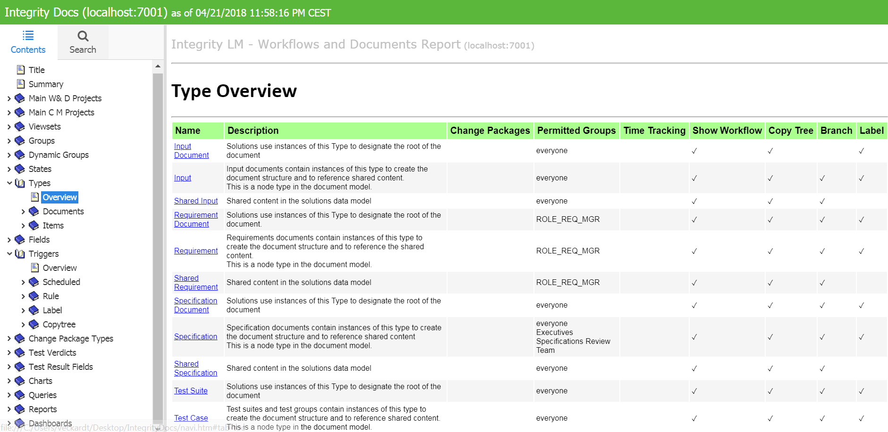

# IntegrityDocs
Creates a set of HTML pages documenting the PTC Integrity Lifecycle Manager configuration.

## Version
11.0.6.3: Created for Integrity 10.9/11.x and with full support of Firefox / Chrome / IE

## Development Status 
Under construction / almost stable

## Purpose
IntegrityDocs exports the current Integrity Server configuration from W&D, and creates HTML pages for review and sharing. Each section under Workflows&Documents will become one node within the report tree. Each section starts with an "Overview" page, and then each element can be reviewed in more detail by drilling down. 



## Use Cases
- Document the current Integrity LM configuration status
- Validate and compare the Integrity LM configuration status
- Present and Discuss the Integrity LM configuration status without the need to have direct Integrity access

## Install
In IntegrityClient folder
- Put the "IntegrityDocs.jar" into your IntegrityClient/lib folder
- Put the "IntegrityDocs.bat" directly into your IntegrityClient folder

- Check and update the IntegrityDocs.bat with the correct client location:
```
SET IC_HOME=C:\Integrity\ILMClient11
```
- In the case of a performance problem that is usually based on too much configuration data in Integrity, you can also disable certain types of objects, such as:   
```
Parameter:
             --noViewsets:   disable Viewsets scan and output
           --noSIProjects:   disable SIProjects scan and output
           --noIMProjects:   disable IMProjects scan and output
               --noStates:   disable States scan and output
                --noTypes:   disable Types scan and output
               --noFields:   disable Fields scan and output
             --noTriggers:   disable Triggers scan and output
               --noGroups:   disable Groups scan and output
        --noDynamicGroups:   disable DynamicGroups scan and output
              --noCPTypes:   disable CPTypes scan and output
             --noVerdicts:   disable Verdicts scan and output
         --noResultFields:   disable ResultFields scan and output
               --noCharts:   disable Charts scan and output
           --noDashboards:   disable Dashboards scan and output
              --noQueries:   disable Queries scan and output
              --noReports:   disable Reports scan and output
      --noGatewayMappings:   disable GatewayMappings scan and output
 --noGatewayImportConfigs:   disable GatewayImportConfigs scan and output
 --noGatewayExportConfigs:   disable GatewayExportConfigs scan and output
     --noGatewayTemplates:   disable GatewayTemplates scan and output
        --noTraceDefaults:   disable TraceDefaults scan and output
              --noMetrics:   disable Metrics scan and output
               --noImages:   disable Images scan and output
             --stopAtType:   Let IntegrityDocs stop after the mentioned type is processed
              --skipTypes:   Let IntegrityDocs skip over listed types (comma delimited list), e.g. list all shared types
     --removeUnusedFields:   Let IntegrityDocs remove from the reports unused Integrity fields

```
- You can add these parameters to the bat command itself or put them directly into IntegrityDocs.bat, 
```
... ityDocs.jar" com.ptc.services.utilities.docgen.IntegrityDocs --noFields --noGroups --removeUnusedFields
```
- It's also possible to generate the output just for one or multiple specific types, then the command will look like this
```
... ityDocs.jar" com.ptc.services.utilities.docgen.IntegrityDocs Defect Project
```

## How to run
- execute the IntegrityDocs.bat in your IntegrityClient folder
- connect to the Integrity environment you like to scan
- the scan will run between 1 and 3 minutes, depending on the amount of Integrity LM configurations (types, fields, charts, reports etc.)
- then review the outcome in <Your Desktop>/IntegrityDocs

## Version Info
- 11.0.0: Added 12 additional object types to the existing Types and Triggers, complete code review
- 11.0.1: You can sort the Overview tables by clicking at the light green headings 
- 11.0.2: Added Main Project for W&D
- 11.0.2: Reports now previewable and downloadable
- 11.0.3: Edit-In-Word Templates download now possible (links provided in the Type form)
- 11.0.3: Added Main Project for CM
- 11.0.4: Added Gateway details
- 11.0.5: Images added
- 11.0.6: Traces, Metrics added
- 11.0.6.3: Word Export added (under review, Images missing) 

##  Development Environment
- PTC Integrity LM 11.0 (also 10.9 is fine)
- Netbeans 8
- Java 1.8

## Known Limitations
- the build-in search does not work yet
- none of the SI or MKS Domain object is exported (primarily because of the expected high data volume)
- the still included "deploy" reporting is no more supported/active since 10.5 or so 
